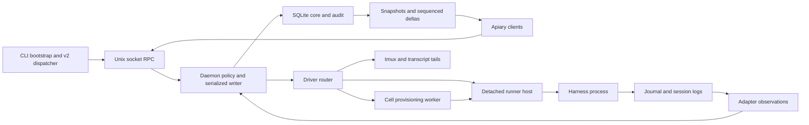

# Honeybee performance map

This map describes source revision `8506467f`. The operational path is the v2
CLI, Unix-socket RPC server, serialized daemon and SQLite core, followed by the
selected runtime driver and harness adapter. The repository also ships legacy
commands and integrations. Their costs do not apply to every v2 request.

The system has several distinct clocks. CLI process startup precedes RPC
admission. Spawn admission precedes provisioning, host startup, harness readiness
and first turn. Mail acceptance precedes eligibility, delivery and model output.
Provider inference time belongs in an end-to-end report but cannot establish a
Honeybee-only speedup.

## Authority and execution flow

SQLite lifecycle, generation, command and mailbox rows are authoritative. Logs
are evidence. Performance changes must preserve generation fencing, exact process
identity, audit replay, idempotency, urgency eligibility and FIFO among eligible
messages. A quiet tick must remain a semantic no-op.

## Components and costs

`B` is retained bees, `G` is generations per bee, `C` is retained commands, `M` is
mail rows, `A` is audit rows, `L` is live runtimes, and `W` is watchers. Complexity
below describes source access patterns, not measured throughput guarantees.

| Component and source | Work and cost growth | Metrics and candidate experiments |
|---|---|---|
| CLI bootstrap, `src/cli-bootstrap.ts`, `src/cliRoute.ts` | Checks `FROZEN`, then imports v2 or legacy dispatcher. Deploy/completion retain legacy routing. | Warm process launch wall time, cold launch separately, import CPU, peak RSS. |
| CLI bundle, `v2/cli/src/main.ts`, `scripts/build-v2-artifact.mjs` | Static daemon and runner-host imports place their dependency graph in the CLI bundle. Production host launch reuses the CLI entry. | Bundle bytes, parse/import CPU, CLI-to-RPC time, host RSS. Test split entries against built artifacts. |
| Store open, `v2/core/src/store.ts:1001` | SQLite WAL/NORMAL with exclusive writer lock, schema/migrations, command replay and guaranteed open write. | Empty/existing/migration open time, WAL bytes, fsync time, peak heap. Never weaken durability for a benchmark win. |
| Bee rows, `store.ts:1483` | Full roster mapping parses JSON fields. Lifecycle filtering in list views happens after mapping. | All/active list p50/p95, allocation bytes, archive ratio. Push filtering into SQL. |
| Latest runtime view, `store.ts:3006` | Anti-join compares runtime history against newer generations. Work grows with pairs of generations within each bee. | Fixed total runtime rows with different generation distributions. Indexed maximum lookup is the first measured target. |
| Single view, `v2/daemon/src/daemon.ts:2001` | `viewOf` and `store.view` repeat bee/current-runtime reads. | Single-view RPC CPU, query count, concurrent read latency. Collapse duplicate reads if material. |
| Core tick, `v2/daemon/src/loops.ts:264` | Every 200 ms by default, fold observations, expire flags, build roster/mail snapshot, run policies, execute commands, deliver and supply tasks. Snapshot refreshes only when audit seq changes within the step. | Empty/retained/live fleet CPU, wall time, wakeups, event-loop delay. A persistent cache needs rollback-safe invalidation and time-dependent policy tests. |
| Recovery, `loops.ts:224`, `daemon.ts:793` | Snapshot live identities, adopt/reconcile, reap exact orphans, inspect bees for wake/restart work. Per-bee command reads can multiply history cost. | Restart-to-ready and first-delivery latency under pending mail, long command history, unread journals. |
| Commands, `store.ts:2746` | Per-bee command reads lack a matching bee index. Ready claim ordering may require sorting. | EXPLAIN plans, ready/settled history ratios, claims/sec. Add indexes and narrow existence queries with migration/replay checks. |
| Flags, `store.ts:2261` | Expiry runs a transaction and flag scan on every step. | No-due-flags CPU, expiry latency, cleared-history scaling. Test a partial expiry index before changing scheduling. |
| Mailbox, `store.ts:2294`, `:2354`, `:2414` | Transactional send and wake intent; full undelivered body mapping for policy; per-bee full history; bounded history page projection. | Acceptance and eligible-delivery p50/p95, bytes/queued message, large body pressure, history page latency. |
| Tasks, `store.ts:3985`, `loops.ts:328` | Durable task transitions and automatic supply gating run with mailbox/lifecycle checks. | Idle supply scans, lists per bee, task auto-feed delay, duplicate supply prevention. |
| Audit and replay, `store.ts:4195`, `v2/core/src/audit.ts` | Append-only history; bounded watcher reads and tail APIs; complete replay remains history-sized. | Bytes/effect, replay events/sec, sparse bee tail latency. Retention/compaction requires a separate contract decision. |
| RPC framing, `v2/daemon/src/rpc.ts` | JSON parse/serialization on the daemon event loop; sync dispatch replies immediately; async verbs settle later. | Dispatch versus serialization versus socket latency, payload bytes, slow-client buffered memory. Preserve response and watch ordering. |
| Watchers, `rpc.ts:135`, `daemon.ts:643` | Reads shared per distinct cursor and bounded by batch+1; stale readers get a gap requiring snapshot. | Matched/divergent cursors, 1/10/100 clients, delta throughput, gap-recovery cost. Existing sharing must not regress. |
| Snapshots, `daemon.ts:2154`, core mirror | Materializes mirror tables and derived credential health, then serializes. | Snapshot size/time/heap by B/M/C/A and account count. Audit seq alone does not invalidate credential-health facts. |
| Accounts/login, `accountsService.ts`, `loginFlows.ts` | Account selection, bounded background limit fetch, home activation, Keychain bridge, login workers and credential landing. | Cache hit/miss latency, refresh concurrency, home disk operations, worker RSS. Provider and Keychain timings are external dimensions. |
| Naming, `autoTitle.ts`, `namingService.ts` | Roster scan once per second, mailbox context lookup, provider-backed generator. | Disabled/enabled idle CPU, repeated deferred candidates, generator RSS and provider cost. |
| HSR driver, `v2/driver-hsr/src/driver.ts` | Per-live-host journal/stat polling coalesced to 50 ms; reads capped at 4 MiB. Host command, socket delivery, observation folding and cursor persistence. | L=1/10/100 idle CPU and total tree RSS; output bytes/sec and lag; replay catch-up; accepted-mail-to-turn. |
| Runner host, `runner-host.ts:166` | Detached host per harness, sync journal and transcript append per output line, socket handling. Incomplete output lines can accumulate. | Syscalls/line, log amplification, newline-free output memory, burst throughput. Batching must preserve crash evidence/cursors. |
| Adapters, `v2/adapters/src` | Provider JSON/event parsing and message encoding, boot/output/turn/error normalization. | Bytes/sec, allocations, malformed/partial frame behavior, parity on recorded event fixtures. |
| tmux, `v2/driver-tmux/src/driver.ts` | Process checks, transcript binding/tails, hook reads; synchronous tmux commands and optional pane capture. | Idle CPU per seat, transcript catch-up, shell-out time, type/paste delivery latency and echo checks. |
| tmux tails, `tail.ts` | 1 MiB read and 512 KiB incomplete-line limits. Typed delivery uses a 300 ms pre-delay and 50 ms per eight-character chunk. | Long-message timing. A 1,000-character typed message has 6.5 seconds of configured sleeps before other costs, not a measured result. |
| Cells, `v2/driver-cell/src` | Off-thread provisioning then HSR; Git image/CoW/clone choice, warm artifacts, locks, capture and cleanup. | Cold/cache-hit/contended provisioning wall time, disk allocation, image size, maintenance delay after readiness. |
| Gateways, `v2/daemon/src/gateways.ts` | Gateway file scan, liveness and executable checks on spawn resolution. | Gateway count, filesystem/syscall cost, stale-entry behavior. |
| Legacy remote, `src/hsr/remoteTransport.ts`, `remoteEventMirror.ts` | SSH forwarding/reconnect and event persistence in legacy paths. | RTT, bandwidth, reconnect delay, child process cost, gap replay. Validate active deployment topology before attributing these costs to v2. |
| Storage maintenance, `src/codexHomeMaintenance.ts`, `scripts/reclaim-codex-home-logs.mjs` | Native harness logs coexist with Honeybee evidence, SQLite history, account homes, Cells and runtime artifacts. | Logical and physical disk bytes by owner, growth/day, reclamation cost. Do not delete forensic or lifecycle truth to improve a number. |
| Build/tests, `scripts/build-*.mjs`, `scripts/run-*.mjs` | TypeScript, esbuild, native optional modules, unit and serial process tests. | Build/test wall time and peak memory. Keep verification costs separate from production speed. |

## Existing measurements and gaps

The July HSR startup report measures legacy paths. It reports CLI p50/p95 improving
from 585/907 to 361/523 ms while native turn start worsened from 857/1496 to
1242/3195 ms. It is not a v2 baseline. The legacy startup script still uses retired
verbs and cannot establish current behavior without revision.

Current code has slow-tick phase logs, event-loop stall logs, persistent I1 delivery
violations and optional spawn diagnostics. These lack a common capture format,
bounded operational timeline, workload identity and automated comparison. This
round adds those measurement tools. Initial exploratory timings can include
concurrent build/test load; final comparisons identify controlled repeated runs.

The provider-free runner covers core views and quiet steps, storage, reopen,
real daemon startup/RPC/idle resources, a real stub spawn/delivery and installed
CLI startup. CPU/allocation profiles and read-only process-tree sampling extend
attribution to other workloads. It does not establish cold-disk startup, live
provider latency, 100-host fleet memory, Cell physical disk savings, tmux throughput,
or remote-node performance. Those need their own fixtures and baseline captures.

## Compatibility observations

The current HSR source preserves detached hosts across daemon restarts. The
mandatory architecture skill still describes daemon-owned child stdio without
survival. The implementation and existing survival tests determine the behavior
preserved in this round. This round does not change that contract.

The tmux driver also retains quiescence-derived turn handling despite the skill's
prohibition on silence-derived lifecycle truth. That discrepancy is recorded for
separate correctness work. Optimizations must not broaden it.
